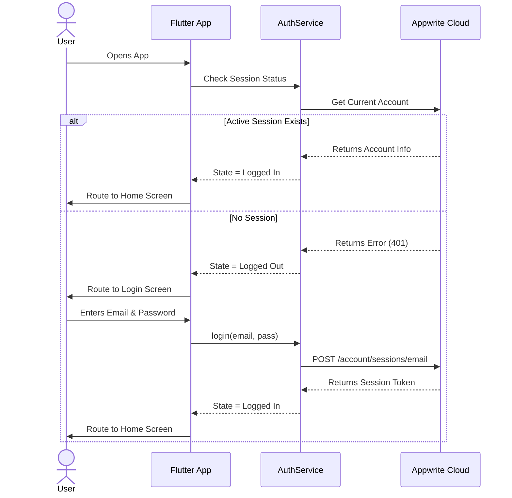
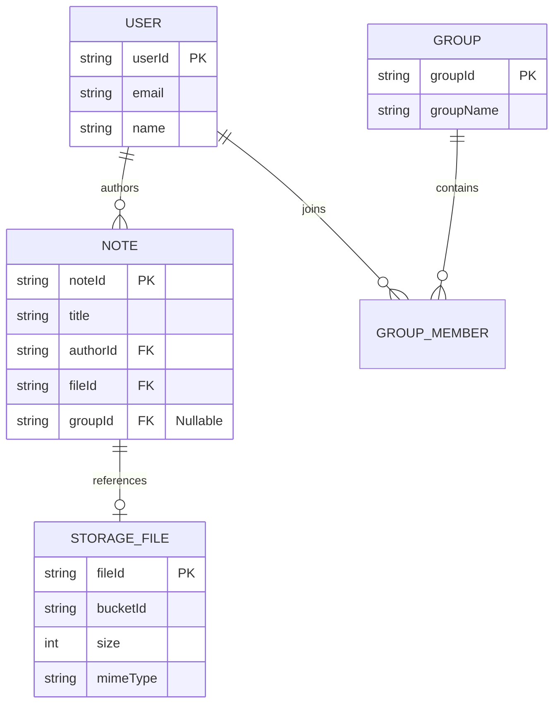
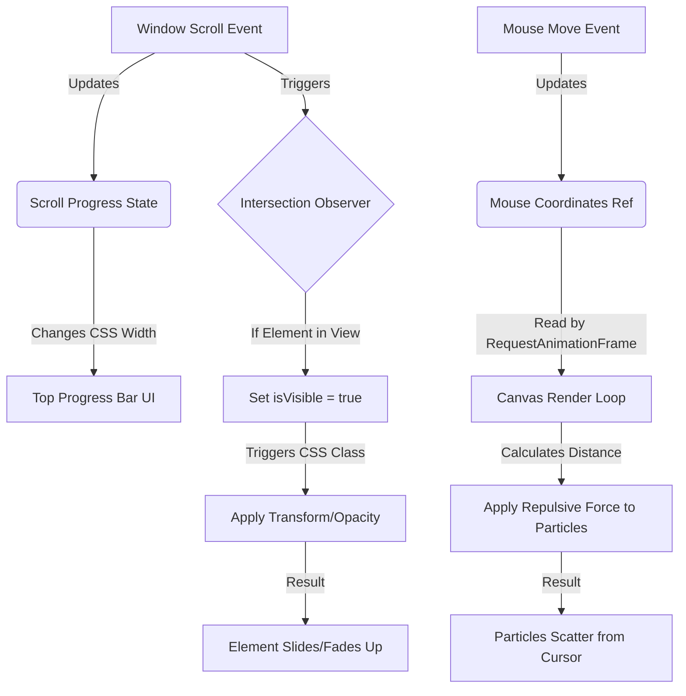

# Visual Documentation

*Note: This document provides conceptual visual aids to understand the application flow. Since markdown cannot execute interactive code, these serve as textual representations of the visual logic.*

## 1. Sequence Diagram: Authentication Flow

## 2. Entity Relationship Diagram (ERD)

## 3. Web Animation Architecture

