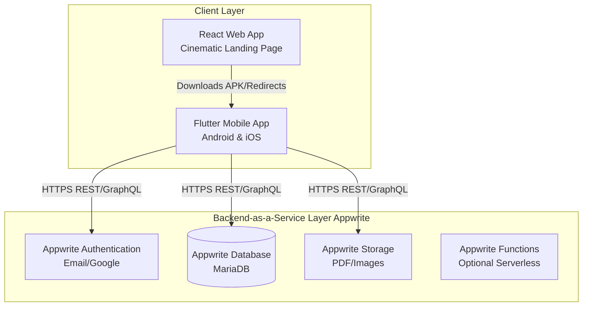
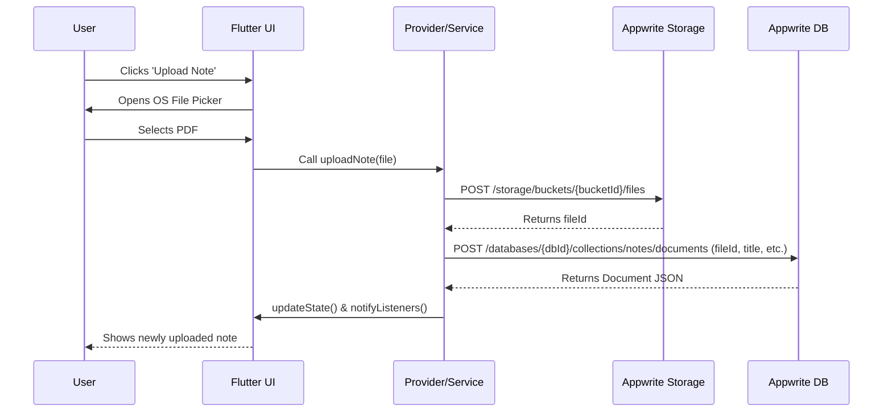
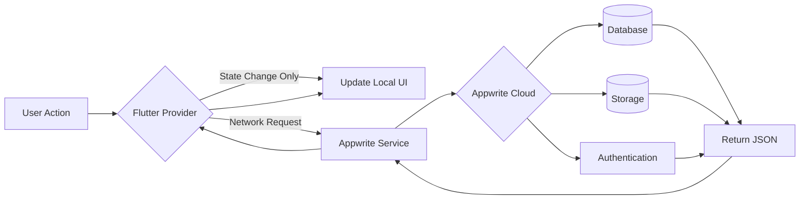
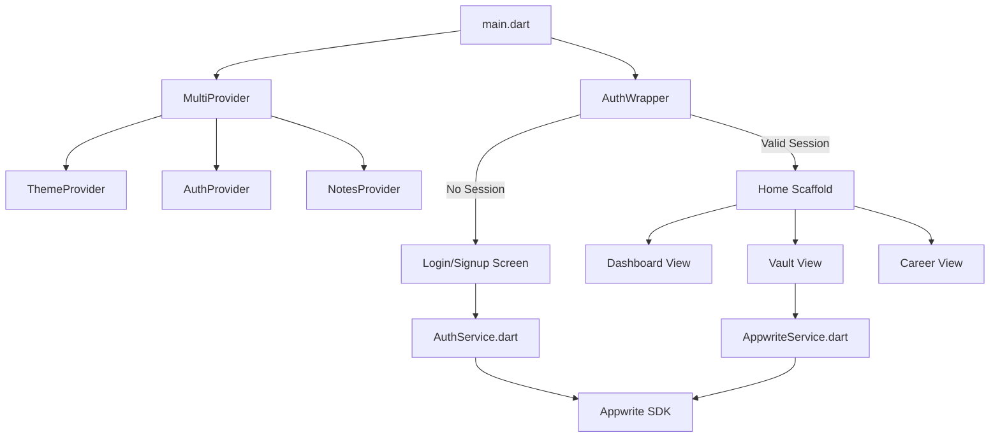

# Architecture Diagrams

## 1. System Architecture Diagram

```mermaid
graph TD
    subgraph Client Layer
        Web[React Web App <br/> Cinematic Landing Page]
        Mobile[Flutter Mobile App <br/> Android & iOS]
    end

    subgraph Backend-as-a-Service Layer Appwrite
        Auth[Appwrite Authentication <br/> Email/Google]
        DB[(Appwrite Database <br/> MariaDB)]
        Storage[Appwrite Storage <br/> PDF/Images]
        Functions[Appwrite Functions <br/> Optional Serverless]
    end

    Web -->|Downloads APK/Redirects| Mobile
    Mobile -->|HTTPS REST/GraphQL| Auth
    Mobile -->|HTTPS REST/GraphQL| DB
    Mobile -->|HTTPS REST/GraphQL| Storage
```

## 2. Request Lifecycle Diagram (Upload Note)

```mermaid
sequenceDiagram
    participant User
    participant Flutter UI
    participant Provider/Service
    participant Appwrite Storage
    participant Appwrite DB

    User->>Flutter UI: Clicks 'Upload Note'
    Flutter UI->>User: Opens OS File Picker
    User->>Flutter UI: Selects PDF
    Flutter UI->>Provider/Service: Call uploadNote(file)
    Provider/Service->>Appwrite Storage: POST /storage/buckets/{bucketId}/files
    Appwrite Storage-->>Provider/Service: Returns fileId
    Provider/Service->>Appwrite DB: POST /databases/{dbId}/collections/notes/documents (fileId, title, etc.)
    Appwrite DB-->>Provider/Service: Returns Document JSON
    Provider/Service->>Flutter UI: updateState() & notifyListeners()
    Flutter UI-->>User: Shows newly uploaded note
```

## 3. Data Flow Diagram

```mermaid
flowchart LR
    A[User Action] --> B{Flutter Provider}
    B -->|State Change Only| C[Update Local UI]
    B -->|Network Request| D[Appwrite Service]
    
    D --> E{Appwrite Cloud}
    E --> F[(Database)]
    E --> G[(Storage)]
    E --> H[Authentication]
    
    F --> I[Return JSON]
    G --> I
    H --> I
    
    I --> D
    D --> B
    B --> C
```

## 4. Module Interaction Diagram (Flutter)

```mermaid
graph TD
    Main[main.dart] --> AuthW[AuthWrapper]
    Main --> Providers[MultiProvider]
    
    Providers --> Theme[ThemeProvider]
    Providers --> AuthState[AuthProvider]
    Providers --> DataState[NotesProvider]
    
    AuthW -- No Session --> Login[Login/Signup Screen]
    AuthW -- Valid Session --> Home[Home Scaffold]
    
    Login --> AuthService[AuthService.dart]
    AuthService --> Appwrite[Appwrite SDK]
    
    Home --> Tab1[Dashboard View]
    Home --> Tab2[Vault View]
    Home --> Tab3[Career View]
    
    Tab2 --> AppwriteService[AppwriteService.dart]
    AppwriteService --> Appwrite
```